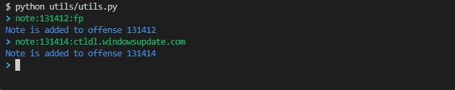

# Interative Qradar shell works with Qradar Advanced Search

 An interactive shell works as a bash shell with Qradar advanced search. Provide autocompleted with defined field from Qradar advanced search

## I. Installation

- ***venv***:
    *note that if you don't want to have any conflict lib with your enviroment, you should create a separate virtual env*

```bash
# create virtual environment
python -m venv 'venv_name'
# activate
source venv_name/bin/activate (linux)
# install dependencies lib
pip install -r requirements.txt
```
## II. Usage
***Note:*** *I intended to build a Telegram Bot integrated with QradarPrompt, but I have no time, so the current code just cover shell Qradar, it doesn't contains Telegram now (just base class to connect tele).*
```bash
#Run shell
python utils/utils.py
```


##### Note usage:
- In interactive shell, you can do some of the following things:
    + Normal advanced search query: 
        + You can do normal search like "select * from events where ..." which is the same as advanced search in Qradar (but in my case, maybe because of misconfiguration, GUI doesn't provide autocompleted field when I type, so I created this script to do the automation, you can edit whatever you want in **fields.txt**)
        + example: select sourceip, destinationip from events where sourceip == '10.2.3.4'
    + Shorten search query:
        + For quickly detect and analysis offense in my daily works, I optimized search query to form:
         ***offense_id***:***select fields***:***group fields***
            * ***offense_id***: The id of the offense in Qradar's dashboard 
              ***select fields***: fields that we want to extract from log
              ***group fields***: fields that we want to group by
                (There are some default fields added to query)
        + Example:
            > 131400:Username,"Web Query":Username -> this query will extract all events belonging to offense_id 131400, except default fields, it will select Username,"Web Query" fields and then group by Username
            > 131400::Username -> this query will extract all events belonging to offense_id 131400, then group by Username (note that group fields will be added to select fields automatically for query works.)
    + Add note to offense:
        + If aforementioned query provide meaningful data, you can note it in the offense for more easily monitoring
        + Example: 
            > note:131400: Content of note

    + rm:
        + As all result of queries are saved on **results** directory, after a time, you can you ***rm*** command to remove all records in this dir (this command support bash, git bash, powershell, cmd, if your bash environment is not compatible, change function in **helper.py**) 

## III. Contributing

- Pull requests are welcome. For major changes, please open an issue first
to discuss what you would like to change.
- Please make sure to update tests as appropriate.
## IV. Disclaimer
- There is no clean code, no penetration test provided, this repo is only for educational purposes. If you got trouble with this, please contact me.